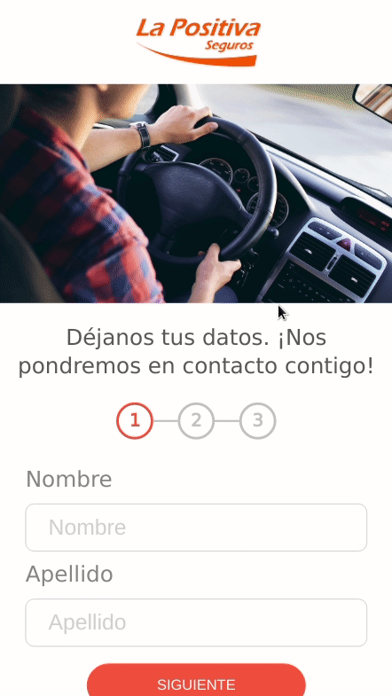

# react-positiva

This is a challenge for Lab+

## Contributing

Pull requests are welcome. For major changes, please open an issue first to discuss what you would like to change.

Please make sure to update tests as appropriate.

## License

[MIT](/LICENSE)
